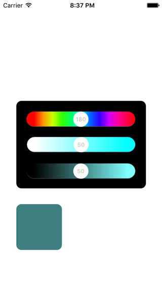

# ColorSlider

 

## Example

To run the example project, clone the repo, and run `pod install` from the Example directory first.

## Requirements

## Installation

ColorSlider is available through [CocoaPods](http://cocoapods.org). To install
it, simply add the following line to your Podfile:

```ruby
pod "ColorSlider"
```

## Author

Eleven Chen, skyhacker@126.com

## License

ColorSlider is available under the MIT license. See the LICENSE file for more info.
